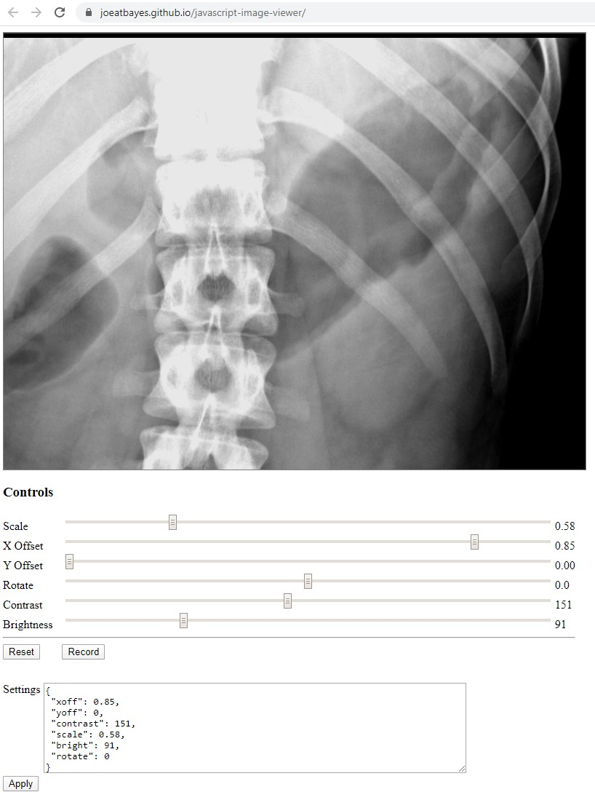
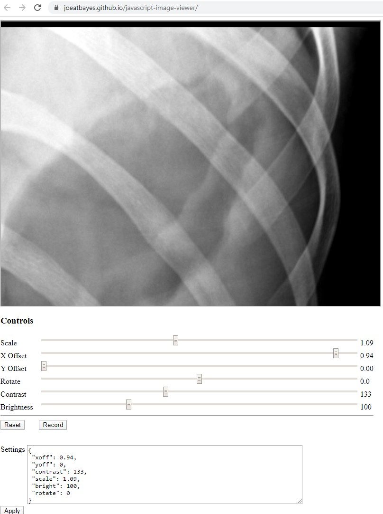
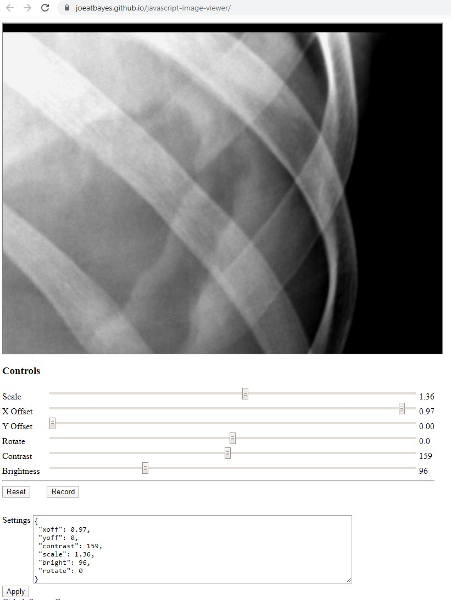
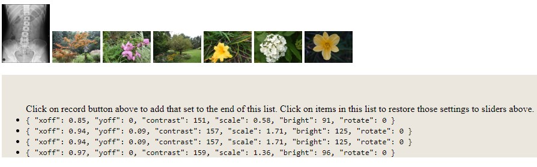
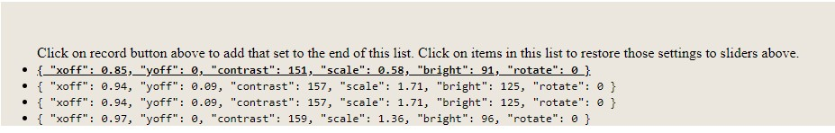

# Virtual image viewer
Code to demonstrate loading an image, zoom, rotate, brighten and save metadata and reproduce same view by re-applying metadata without the need to save duplicate binary images.    It is intended to dramatically reduce the need to save and transmit binary image files.    It is written in native JavaScript with no external dependencies.   The source code is under 4K btyes when minified which means it loads fast, runs fast and is easy to incorporate into larger systems.

[Live Demo](https://joeatbayes.github.io/javascript-image-viewer/)

This system is designed to support professional reviewers who need to be able to record and recreate the exact image view they where looking at the time they made a determination or diagnosis.     The system only needs the original image and can re-create the view using a simple data structure  without storing duplicate binary image files.   Since these images can easily consume 5 to 20 megabytes this saves a lot of space.   It also allows retrieval and switching between views nearly instant.

As shown below the 4 views used in the determination at 6 megabytes each would normally consume 24 Megabytes of additional server storage.    By storing only the data we need to regenerate the view we only  save  90 bytes per view or a total of 360 bytes for 4 views.    The metadata storage consumes 16,666 times less storage compared to saving binary images with the views.  The small size of the meta data makes it easy to save in the main database system which can simply system design.  

The use of the metadata saves in network resources  since we only need to transmit the original view to the browser.    Reducing storage consumed by the view images also reduces the backup sizes and the associated network infrastructure required to duplicate images to DR sites.  

You help annotate the drawing with lines by clicking on the image.  To stop one series of lines and start another press ESC or the button "Stop Draw".   To remove all lines for the current view press the "Clear Draw" button.

# Sample Views

### Default view for XRAY

### Zoom in view showing the right rib with contrast adjusted to make it easier to see

### Zoomed to show details of right Rib in even greater detail

### Zoom adjusted to show top 2 right ribs. 

### Settings recorded to produce each of the views above.

### Click on row you want to see again the view will be adjusted immediately to reflect the prior view.

# Contributing

The recommended strategy for contribution is to fork the repository and then submit a pull request with your enhancements.   I can also be reached on [linkedin](https://www.linkedin.com/in/joe-ellsworth-68222).

You can also submit issues against this repository and I may implement the enhancements when I get the time. 

Thanks Joe Ellsworth

